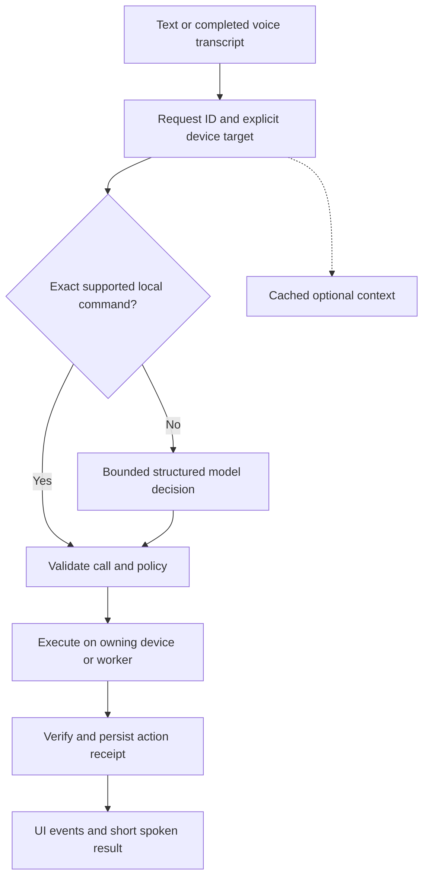

# Aura: code audit and 14-day implementation plan

Prepared 12 September 2026. Runtime budget: **no paid APIs**. GPT-6 Astra is a development/review resource, not a proposed runtime dependency.

## The decision

Aura has enough existing pieces to become a useful personal assistant. Its execution pipeline currently has broken contracts, unnecessary serial work, and unreliable completion reporting. A stronger model would still encounter these defects.

Spend the fortnight making a defined set of everyday actions dependable: correct device, correct arguments, bounded waiting, verified outcomes, and a working stop button. Preserve FastAPI, the existing Windows integrations, and the current mobile app. Introduce small internal boundaries as each path is repaired.

A realistic two-week result is a reliable foundation with approximately 15–20 selected command intents, useful conversation, desktop voice, and a functioning phone-to-PC remote. Universal autonomous computer use and unrestricted proactive behavior require further work. They should build on this foundation after it passes its acceptance tests.

## Scope and evidence

The audit traced the current backend agent/router/server, Windows and browser tools, voice capture/STT/TTS, memory/vault, Discord integration, current mobile application, and its Needle adapter. Historical documents were cross-checked against code: several architecture/model/test claims are stale. The separate desktop UI repository referenced by configuration was not audited. Vendored native binaries, generated build outputs, dependencies, and the legacy mobile application were not exhaustively audited.

There were numerous pre-existing working-tree changes. Application code was not changed by this audit. Audit documents and isolated diagnostic scripts are the only new deliverables.

Validation completed during the audit:

- The existing Python unit suite passed: **one test**, with the device-lock action mocked.
- The current mobile TypeScript check passed. This verifies types, not runtime endpoint or action correctness.
- Executing the actual mobile keyword router in isolation reproduced incorrect device/action routing.
- An isolated probe of the actual desktop TTS methods reproduced premature completion and audio being queued after stop. Synthesis and audio devices were replaced with fakes.
- Source inspection verified the missing tool-schema handoff, endpoint mismatches, blocking weather refresh, and other findings below.

The saved [tool reliability probe](C:/AURA_V2/docs/audit/tool_reliability_probe.py) extracts selected definitions from source and substitutes fake handlers. It reproduced malformed JSON dispatching volume 50, an unhandled browser tool marked successful, an error dictionary marked successful, dropped search arguments, leaked split function text, and a URI launch reporting failure after its mocked launch. See the [recorded results](C:/AURA_V2/docs/audit/VALIDATION_RESULTS.md).

No live model requests or actual device controls were used for validation. Existing logs do not establish a production latency distribution or prove which defect caused a particular past incident. Timing numbers below are **proposed targets**, not measured improvements. CPU/RAM/GPU details could not be retrieved through the restricted hardware query; Day 1 includes hardware inventory and measurement.

## Major bottlenecks, in priority order

### 1. Tool definitions never reach the desktop tool model

**Evidence:** [agent.py:600](C:/AURA_V2/core/agent.py:600) sends messages, token limits, streaming and timeout settings, but no `tools` parameter. `TOOLS` is imported at line 26. The response path at line 625 reads `msg.content` and tries to parse text tags; it does not process native `msg.tool_calls`. [agent.py:155](C:/AURA_V2/core/agent.py:155) explicitly asks the model to print a custom function-tag format.

**Consequence:** The model must guess tool names, arguments and a fragile text format. Valid structured calls are not handled. A function-looking response can become visible text or be scrubbed away without an action. This is a concrete mechanism for the kind of symptom you described; your illustrative tag was not treated as an observed log entry.

**Fix:** Send only the relevant implemented tool schemas to a compatible model. Consume native structured calls, validate their names and arguments, execute them, and return correlated tool results. Keep prose and actions separate throughout streaming and TTS. For an optional model lacking native tool support, use a schema-constrained decision object followed by the same local validation; never execute arbitrary prose.

**Acceptance:** Native calls with empty text execute correctly; malformed/unknown calls execute nothing; tool-looking prose is never treated as success. The model sees only tools the current device can actually run.

### 2. Invalid arguments and tool errors can turn into incorrect actions or success

**Evidence:** [agent.py:109](C:/AURA_V2/core/agent.py:109) converts invalid JSON to `{}`. Dispatch then supplies defaults, including volume 50 and mute true, at line 357. `browser_control` is advertised in [registry.py:25](C:/AURA_V2/tools/registry.py:25) but has no dispatch branch. The dispatcher at [agent.py:464](C:/AURA_V2/core/agent.py:464) marks a tool successful even when its result contains an error. `web_search` dispatch drops the advertised mode/items/aspect arguments at line 368.

**Consequence:** “Sometimes the wrong thing happens” can be a parser/default bug. “Done” can mean only that a function returned a dictionary. Some advertised actions cannot work at all through this path.

**Fix:** A single registry entry must own argument validation, handler, device availability, timeout, retry policy, and result verification. Required arguments must be genuinely required. Normalize every handler into a typed result; a returned error becomes failure. Reject unknown actions and extra/invalid fields. Generate tool declarations from this registry rather than maintaining an independent schema and dispatch list.

**Acceptance:** Registry coverage is complete; missing/invalid arguments cause zero side effects; error results produce failed jobs; advertised search parameters reach their handler.

### 3. Simple commands pay for unnecessary model calls

**Evidence:** [agent.py:484](C:/AURA_V2/core/agent.py:484) and [server.py:235](C:/AURA_V2/core/server.py:235) default to `deep`. [pipeline.py:470](C:/AURA_V2/voice/pipeline.py:470) inherits that default. After a tool action, the loop normally requests another full tool-model completion; once it receives prose, [agent.py:663](C:/AURA_V2/core/agent.py:663) can start an additional Nvidia summary. Tool decisions are nonstreaming. The loop permits ten rounds.

**Consequence:** A short control request can involve several remote inference stages before the user receives a spoken result. A streaming HTTP response does not make its preceding work stream.

**Fix:** Add exact local routes for selected commands such as explicit mute/unmute and numeric volume settings. These use zero LLM calls. For less explicit actions, use one structured decision followed by execution and a short result template where appropriate. Enable multi-step research only when requested, with its own budget and progress events.

**Acceptance:** Selected local commands still work with network access disabled. A verified mute does not require another model to say it succeeded. Research continues to work as a separately bounded job.

### 4. Unrelated weather and memory work block the request

**Evidence:** [agent.py:248](C:/AURA_V2/core/agent.py:248) awaits live context before model execution. [context.py:163](C:/AURA_V2/memory/context.py:163) refreshes weather on a cold or expired 30-minute cache. This can involve sequential geolocation and weather requests with 5-second and 10-second HTTP timeout settings. Memory lookup then embeds that time/weather context instead of the user's question at agent line 250. Conversation turns are also synchronously embedded and saved.

**Consequence:** Identical commands can behave differently depending on cache age. CPU/database work and irrelevant context increase cost and waiting. The timeout settings are operation settings, not a guaranteed 15-second total cap.

**Fix:** Read a cached context snapshot immediately, refresh it in the background with one refresh owner, and fetch weather in the foreground only for weather-dependent requests. Query memory using the user's request when relevant. Send transcript indexing to a bounded background worker. Explicit “remember this” writes must receive a durable receipt before being confirmed.

**Acceptance:** Expired weather plus a hanging network cannot delay mute. Ordinary controls do not query the vector store. An explicit saved memory survives restart and is recalled using a related user query.

### 5. Timeouts, retries and blocking work have no shared budget

**Evidence:** [router.py:20](C:/AURA_V2/core/router.py:20) creates clients without retry overrides. The installed SDK has two retries by default. A 30-second request timeout can therefore be followed by more attempts and retry waits, with further application fallbacks afterward. Many synchronous handlers run directly inside async `_run_tool` at [agent.py:357](C:/AURA_V2/core/agent.py:357). Browser wrappers wait on futures, including [whatsapp_web.py:100](C:/AURA_V2/tools/whatsapp_web.py:100), without cancelling them on timeout.

**Consequence:** Long processing periods can include invisible retries. Blocking an async server loop delays other requests and UI events. A timed-out browser action may continue and act later.

**Fix:** Give each turn a total deadline and each stage a smaller deadline. Configure retries explicitly, use provider health/quota information, and stop retrying once the turn budget is exhausted. Run blocking work in bounded workers. Serialize actions that share a desktop, clipboard, browser page or audio device. Cancel underlying futures where supported. If an external effect may already have happened, report an unknown outcome and verify before retrying.

**Acceptance:** Inject hanging providers, 429s and slow handlers. Every request reaches a terminal state; a slow browser job does not freeze health/state updates; no timed-out send is blindly repeated.

### 6. Keyword shortcuts can select the wrong action

**Evidence:** Desktop routing uses substring matching in [router.py:44](C:/AURA_V2/core/router.py:44). The YouTube bypass at [agent.py:519](C:/AURA_V2/core/agent.py:519) checks fragments such as `play` and `yt`, ignores negation, and executes directly outside normal dispatch. Mobile [taskRouter.ts:47](C:/AURA_V2/mobile_aura_V2/src/router/taskRouter.ts:47) picks the first matching keyword with high confidence.

Actual isolated mobile-router outputs included:

| Input | Current output |
|---|---|
| Do not call 5551234567 | Phone call |
| Explain this text | Send SMS |
| Open Chrome on my PC | Open app on phone |
| Turn the phone volume up | Phone call |
| Tell me about smartphone batteries | Phone call |

**Fix:** Use narrow command grammars for the fast path, with explicit device targeting and tests for negation, quoted commands and conversational mentions. Ambiguity should produce a structured clarification or a model decision. A model declining a request must not automatically fall through to a more aggressive keyword executor. Put all routes through the same validation and execution service.

**Acceptance:** The examples above execute no unintended actions. Explicit device selection wins. “Don't mute,” “explain mute,” and “mute my PC” have distinct outcomes.

### 7. Mobile tools lose arguments and use incompatible backend endpoints

**Evidence:** [needleRouter.ts:195](C:/AURA_V2/mobile_aura_V2/src/router/needleRouter.ts:195) reads model arguments but returns only a capability. [chat.tsx:116](C:/AURA_V2/mobile_aura_V2/app/(drawer)/chat.tsx:116) executes mobile tools with only an extracted phone number. Needle uses `package`/`message`, while the executor expects `packageName`/`body`.

The API client also disagrees with the server:

| Mobile request | Current backend |
|---|---|
| POST `/tools/execute` | No matching route |
| GET `/system/stats` | GET `/system-stats` |
| GET `/media/now-playing` | GET `/now-playing` |
| POST `/system/focus` | No matching route |
| POST `/vault/read` | GET `/vault/read`, query parameter |
| POST `/vault/delete` | DELETE `/vault/delete`, query parameter |

See [client.ts:32](C:/AURA_V2/mobile_aura_V2/src/api/client.ts:32), [server.py:997](C:/AURA_V2/core/server.py:997), and [server.py:1552](C:/AURA_V2/core/server.py:1552).

**Fix:** Carry a validated `ToolCall` object from extraction to execution. Share or generate schemas and client bindings from a checked-in API contract. Introduce a small authenticated command endpoint using the same execution service as voice/chat. Disable unsupported capabilities and distinguish empty data from request failure.

There is also a separate mobile path that explicitly asks the cloud model to print fenced `tool_call` text in `src/api/openrouter.ts:5–15`, then merely displays/speaks the response in `chat.tsx:181–195`. That path has no corresponding execution step. Replace it with the same structured protocol; adding a nicer output scrubber would only hide the broken connection.

**Acceptance:** Contract tests cover method, path, arguments and response shape. A named app/URL/SMS draft retains its arguments all the way to the executor. The PC receives commands explicitly addressed to the PC.

### 8. “Processing,” completion and stop are unreliable

**Evidence:** Mobile streaming starts an async task and immediately returns a cancel function; [chat.tsx:207](C:/AURA_V2/mobile_aura_V2/app/(drawer)/chat.tsx:207) can clear processing before that task ends. [openrouter.ts:116](C:/AURA_V2/mobile_aura_V2/src/api/openrouter.ts:116) only sets a boolean on cancel; fetch and a pending read are not aborted. Desktop [agent.py:487](C:/AURA_V2/core/agent.py:487) lacks an explicit cancellation finalizer. Global `STATE:` events have no turn ID. WebSocket broadcasting holds one shared lock while awaiting clients at [server.py:57](C:/AURA_V2/core/server.py:57).

**Fix:** One owner for each request and one authoritative lifecycle: accepted, routing, waiting for model, queued, executing, verifying, speaking, then completed/failed/cancelled/timed out. Include request ID and event sequence. Abort actual network readers, reject stale events, and make stop available before the first token. Use bounded per-client event queues.

**Acceptance:** Repeated send, stop-before-first-token, disconnect, screen unmount and late responses cannot overwrite another request. Cancellation is recorded and visible. A disconnected/slow UI does not block everyone else.

### 9. Voice capture and speech playback have concrete lifecycle defects

**Evidence:** PTT capture discards the first 0.4 seconds at [pipeline.py:168](C:/AURA_V2/voice/pipeline.py:168) and rejects sufficiently short retained audio at line 209. Flow recording has no maximum utterance duration at line 649. Desktop TTS removes text from its queue before synthesis, while [tts.py:135](C:/AURA_V2/voice/tts.py:135) uses empty queues to decide completion. Stopping clears current queues but cannot invalidate audio still being synthesized.

The offline TTS probe returned immediately while synthesis was still in flight, then observed one audio item queued after stop. This demonstrates a real state/cancellation bug without involving speakers.

**Fix:** Use one continuous capture stream with pre-roll, bounded utterances and measured voice activity detection. Start with dependable PTT; improve hands-free interruption afterward. Account for synthesis in progress and tag text/audio by turn generation. Stop invalidates that generation before clearing queues. Tie mobile speech completion to native callbacks. Consolidate duplicate STT model ownership.

**Acceptance:** Short commands preserve their first word. Noise cannot leave recording active indefinitely. Stopped speech never resumes from late synthesis. “Finished” requires both generation and playback to finish.

### 10. Shared async clients may cross event loops

**Evidence:** Persistent clients are module globals in [router.py:20](C:/AURA_V2/core/router.py:20). Voice creates a new loop per utterance through [pipeline.py:513](C:/AURA_V2/voice/pipeline.py:513), while HTTP requests use the server loop.

**Consequence:** Reusing pooled async transports across different or closed loops is a credible source of intermittent failures. This architecture is verified; a corresponding runtime failure was not reproduced in the available logs.

**Fix:** Own orchestration and HTTP clients in one long-lived server lifecycle. Submit voice turns to that service; keep capture/playback workers separate. Close clients during shutdown. Avoid introducing another loop per request.

**Acceptance:** Alternate and overlap voice, HTTP and mobile turns in a mocked stress test, then repeat on the actual machine. No loop-ownership errors, orphaned jobs or leaked connections.

### 11. Several actions report more than they actually verified

**Evidence:** URI app launch can call `os.startfile` and then reference an unassigned `resolved` variable at [system.py:127](C:/AURA_V2/tools/system.py:127), returning an error after opening the app. WhatsApp can select the first search result after contact matching fails at [whatsapp_web.py:187](C:/AURA_V2/tools/whatsapp_web.py:187). [pending.py:81](C:/AURA_V2/core/pending.py:81) marks approval before execution and returns outer success even if execution fails. Mobile battery/Wi-Fi handlers return success despite being placeholders at [mobileExecutor.ts:58](C:/AURA_V2/mobile_aura_V2/src/capabilities/mobileExecutor.ts:58). Opening `tel:` does not verify that a call happened.

**Fix:** Fix URI launch's result construction. Remove first-contact fallback. Check destination identity before a send. Separate approved, executing, sent, failed and outcome-unknown states. Report precise receipts: “dialer opened,” “draft prepared,” or “volume read back as 35%.” Keep placeholders unavailable. Media toggles and window-title guesses must not be treated as verified playback state.

**Acceptance:** An app opening successfully does not generate a false failure. An unresolved contact causes no send. Retrying a request ID cannot duplicate a completed mutation. A permission prompt/draft is reported accurately.

Search needs a follow-through check when argument forwarding is repaired: `tools/web.py:168–234` contains a news branch with new threads attempting to obtain an event loop and a blocking 12-second event wait. That branch is currently hidden from agent requests by the dropped `mode` argument. Repair it with bounded async work or explicit worker offload before enabling news/compare modes. Browser sessions likewise need transaction ownership and a recovery path after closure; shared global pages and broad first-match clicks cannot guarantee the requested target.

### 12. Free-only operation, access control and regression coverage need explicit rules

**Evidence:** [config.py:29](C:/AURA_V2/core/config.py:29) selects an OpenRouter model whose official page lists a price. This audit did not inspect billing or establish that you were charged. Mobile has a hardcoded backend token; backend [server.py:218](C:/AURA_V2/core/server.py:218) trusts the caller-controlled Host header for an authentication exemption, and its WebSocket route has no authentication check. Discord classification/replies call the general agent through [discord_bot.py:74](C:/AURA_V2/comms/discord_bot.py:74), mixing third-party content with a tool-capable path. The only current backend unit test checks one alias; several older integration checks accept response wording instead of observing an effect.

**Fix:** Enforce a provider/model allowlist with zero paid fallbacks. Keep local commands operational when quotas run out. Pair devices with protected tokens and authenticate HTTP/WebSocket command access consistently. Use a no-device-tools context for third-party message classification and drafting. Replace broad “sounds successful” checks with action and state assertions. Establish a reproducible environment; requirements currently omit directly imported packages such as `openai`, `requests`, `playwright`, `pyautogui` and `discord.py`.

**Acceptance:** Exhausted free quota yields a bounded explanation while local controls keep working. Fake localhost Host headers cannot bypass auth. Third-party text cannot acquire PC-control tools. A fresh development environment can install and run the relevant tests from documented dependencies.

## The intended architecture

Use these boundaries, introduced incrementally:

- `core/contracts.py`: request, tool-call, tool-result and event models.
- `core/execution.py`: validation, device selection, deduplication, dispatch, verification and cancellation.
- `core/providers.py`: optional model adapters, free-only allowlist, deadlines and health/quota state.
- `core/agent.py`: decide whether more work is needed using the contracts; no direct device calls in special branches.
- Existing `tools/*`: small adapters with consistent result semantics.
- `core/server.py`: transport and lifecycle, gradually extracting touched routes into small modules.
- Mobile: generated API bindings plus a single request manager; the same semantic tool names and argument shapes.

An action receipt should carry `request_id`, `tool_call_id`, tool name, device ID, status, elapsed time, result data, verification evidence and a structured error. Useful statuses include succeeded, failed, unavailable, awaiting confirmation, cancelled and outcome unknown. “Unknown” is essential when a timeout occurs after a possible external effect.

A capability definition should include argument schema, availability, read/write classification, handler, deadline, whether retry is safe, and a verifier. The validator must check types, ranges, required fields, target availability and authorization. A valid JSON object is not evidence that an action is semantically correct.

Use durable request IDs for mutations. SQLite is a reasonable small local store for command receipts/jobs, with transactional updates. Migrate existing JSON jobs/pending data deliberately; keep a backup and a rollback path. Do not migrate every unrelated store during this fortnight.

Cancellation must reach the provider, queued work and speech generation. Thread cancellation alone cannot stop an already-running OS call. Check cancellation before a side effect, serialize shared resources, and verify ambiguous outcomes before retrying. Parallelize independent read-only fetches only.

## Free runtime choices

**Local controls:** Python/Windows/native device APIs and narrow deterministic parsing. No language-model request is necessary for an explicit supported control.

**Speech:** Keep faster-whisper and benchmark one managed local configuration. Start with existing local TTS support that successfully runs on the machine; test quality and cold/warm latency before choosing its default. Keep a working local fallback. The existing Edge TTS path uses a remote service, so it must not be described as offline speech. PTT is the initial dependable entry point; wake-word support is optional until its setup and detection pass tests.

**Language reasoning:** A free Groq account is an optional route for ambiguous requests. Its currently documented free limits for `openai/gpt-oss-120b` include 8,000 tokens/minute and 1,000 requests/day; large repeated prompts can hit the token limit early. Account limits and availability must be checked during implementation. Use its native tool protocol and a compact relevant tool set. [Groq rate limits](https://console.groq.com/docs/rate-limits), [tool calling](https://console.groq.com/docs/tool-use/overview).

**Fallback:** Prefer a benchmark-qualified local model when existing hardware can run it acceptably. Ollama documents both local tool calling and structured outputs; those capabilities still require application validation. Choose model size using measured command accuracy and p95 latency, not parameter count alone. If hardware cannot meet the target, retain deterministic local controls and make model unavailability explicit. [Ollama tool calling](https://docs.ollama.com/capabilities/tool-calling), [structured outputs](https://docs.ollama.com/capabilities/structured-outputs).

**OpenRouter:** Its free model router or a verified free model may be an optional fallback. The documented no-purchase free allowance is 50 requests/day, so it is unsuitable as an assumed unlimited backbone. The current backend `meta-llama/llama-3.1-8b-instruct` route is priced and must be removed from the free-only route list. Do not substitute an arbitrary `:free` suffix without checking that the variant exists and supports the needed interface. [Free allowance](https://openrouter.ai/docs/faq), [current configured model](https://openrouter.ai/meta-llama/llama-3.1-8b-instruct).

Research, search and remote services must fail gracefully when unavailable. No key rotation to evade quotas, paid fallback, mandatory hardware purchase, or payment-dependent feature is part of this plan. “Free runtime” here means no service/API payments using the devices you already own; local computation still consumes device resources. Free cloud requests also leave the device, so remove the current prompt's blanket privacy guarantee.

## Targets and measurement

Use monotonic timings and a request ID across capture, transcription, routing, context, model wait, execution queue, execution, verification and first audio. Record provider/model, retries, token usage, queue length and terminal outcome. Keep raw transcripts, tool arguments and personal data out of routine performance logs.

| Metric | Proposed release target |
|---|---|
| Acknowledgment after input is submitted | p95 under 250 ms on the local/LAN path |
| Selected simple controls, text accepted to verified result | p95 under 750 ms when already warm; no remote model call |
| Voice, end of speech to simple verified action | Initial p95 target under 2.5 seconds; validate hardware on Day 1 |
| First-token/provider wait | Configured bounded wait; typically start with an 8-second interactive budget and tune from evidence |
| Model-assisted ordinary turn | Initial total budget 15 seconds, then a terminal result or clear explicit continuation choice |
| Long browser/research task | Separate bounded job with stage updates and cancellation; no silent indefinite spinner |
| Correct supported actions | At least 95% on the agreed real-command set |
| False success, wrong device, ignored negation | Zero in the release regression set |
| Cancellation | UI acknowledgment under 250 ms; no new side effect after cancellation is accepted unless already committed and reported |
| Free quota exhaustion | Local supported controls remain operational |

Measure p50 and p95 separately for text versus voice, local versus model-assisted, warm versus cold, and successful versus failed turns. Do not hide timeouts by excluding them from the report. Count **action observed**, **result verified**, and **response received** separately. These targets can change after measurement; their tradeoffs must be recorded.

## The 14-day implementation schedule

Scheduling assumption: **3–4 hours of your time per day**, with bounded AI development tasks alongside it. You did not yet confirm daily availability. If you have less time, use the scope cuts below. Each day ends with a runnable increment and a short evidence log.

### Day 1 — Freeze scope and measure the current failures

**Work:** Preserve the current working tree in an agreed baseline branch/snapshot. Record actual Python/Node versions, CPU/RAM/GPU, phone model, microphone and active providers without copying secrets. Choose 15–20 command intents and write 50 real utterances, including paraphrases and requests that should do nothing. Add stage timing to the existing path before refactoring. Capture warm/cold runs and one offline run. Inventory dependencies and available tools; mark placeholders unavailable.

**Owners:** You choose expected behavior and perform physical-device checks. Astra adds instrumentation and defines the test format. The free model inventories endpoints and converts your examples into fixtures.

**Done when:** Every sample has an expected device/action/arguments/outcome, and the baseline distinguishes model wait from actual tool execution. No “faster” claims without before/after evidence.

### Day 2 — Establish the execution contract

**Work:** Define strict request, tool-call, result and event types. Make one registry authoritative for schemas and handlers. Implement missing-field/type/range checks and normalized errors. Route a small initial set—mute, volume, app launch, URL opening—through it. Add registry coverage tests and stop marking returned errors successful. Require explicit device targeting where ambiguity matters.

**Owners:** Astra owns contracts and dispatch. The free model implements test cases from the approved schema and inventories remaining adapters. You review the receipt wording and command expectations.

**Done when:** Invalid JSON, unknown names, missing arguments and unavailable tools cause zero calls to fake device handlers. All initial tools return consistent receipts. Existing endpoints can call the new service through compatibility adapters.

### Day 3 — Repair structured tool calling and wrong-action routing

**Work:** Send selected tool schemas and handle native tool calls, including responses with no prose. Remove action execution through generated tags. Replace substring shortcuts with narrow tested rules. Fix mobile argument preservation and align argument names. Keep model uncertainty, negation and unsupported commands from entering an aggressive fallback.

**Owners:** Astra implements model/route behavior and mobile extraction changes. The free model adds table-driven cases for negation, mentions, quotes and device names. You test your actual phrasing.

**Done when:** The audit's wrong-routing examples are fixed, a fake native call executes once, malformed output does nothing, and no function markup reaches spoken output as if it were a completed action.

### Day 4 — Remove unnecessary latency from common commands

**Work:** Implement the zero-model route for the initial controls. Make ordinary mode the default; research becomes explicit. Stop re-summarizing verified simple results with another model. Serve cached optional context without waiting for refresh. Query memory only when useful, using the request. Set compact prompt/history budgets and expose only relevant capabilities.

**Owners:** Astra owns the critical path. The free model writes result templates and benchmark fixtures. You compare the same commands with the Day 1 baseline, including expired weather and disconnected internet.

**Done when:** Supported local controls make zero external calls, and weather/memory failures cannot delay them. Record latency improvement by stage, not just total response speed.

### Day 5 — Consolidate loop ownership, deadlines and workers

**Work:** Own model clients in the server lifespan and route voice through the same orchestration service. Move blocking work into bounded workers. Serialize GUI/browser/device mutations. Add total request deadlines, per-stage budgets, explicit retry limits and a free-only provider allowlist. Add deduplication for mutation request IDs. Track unknown outcomes if timeout happens after a possible effect.

**Owners:** Astra owns concurrency and retry semantics. The free model supplies fake slow providers and handler fixtures under a precise interface. You test concurrent phone/desktop use.

**Done when:** Hanging model/browser work produces a terminal result while the server remains responsive. Duplicate mutation IDs execute once. No paid route can be selected by fallback.

### Day 6 — Make stop and progress dependable

**Work:** Add request IDs/sequence numbers to lifecycle events and compatibility handling for existing UI messages. Finalize jobs on success, error, cancellation and timeout. Implement real mobile AbortController handling and stale-event rejection. Keep stop visible before first token. Fix per-client WebSocket backpressure. Persist minimal job/action receipts transactionally and recover interrupted jobs on restart.

**Owners:** Astra owns lifecycle, transport cancellation and persistence. The free model handles bounded status/error UI using the agreed event types. You test stop, repeated send, disconnect and reconnect.

**Done when:** No request spins forever in the injected-failure tests. A late old response cannot modify a new request. Stop does not silently allow an unstarted action to run later.

### Day 7 — Repair the current mobile-to-PC contract

**Work:** Implement or adapt the authenticated command endpoint around the shared execution service. Align all mobile method/path/body/query contracts. Generate or check in typed API bindings. Repair app/URL/SMS-draft argument plumbing. Show unavailable actions truthfully. Implement pairing and remove hardcoded tokens and Host-header authentication bypass; cover WebSocket access too. Keep existing desktop clients working through documented compatibility behavior.

**Owners:** Astra owns backend/phone integration and authentication. The free model updates generated bindings and isolated error views. You perform LAN pairing and verify the target device physically.

**Done when:** Phone commands reach the intended PC tool with exact arguments. Notes and telemetry use valid endpoints. An unauthenticated caller cannot control the PC by changing its Host header.

### Day 8 — Fix desktop speech completion and interruption

**Work:** Track synthesis in flight, tag audio by generation, and invalidate cancelled generations before enqueue. Replace queue-empty completion with a proper completion signal. Remove recursive timeout extension. Tie mobile TTS promises to native completion/stopped/error callbacks. Keep control acknowledgments short and begin speech only from truthful receipts.

**Owners:** Astra owns TTS synchronization. The free model turns the offline race reproductions into regression tests. You test repeated stop, quick consecutive commands and changing voices during idle.

**Done when:** The reproduced TTS bugs no longer occur. Speech cannot return after stop, and the UI stays speaking until generation and playback really finish.

### Day 9 — Make desktop voice input reliable

**Work:** Use continuous capture with a small pre-roll buffer, bounded recording duration and proper endpointing. Remove first-word loss. Consolidate STT initialization and expose loaded model/device readiness. Benchmark short utterances on the actual machine before changing model size or compute settings. Keep PTT usable while hands-free behavior is being tuned. Add an explicit policy for dropping stale microphone buffers and suppressing assistant echo.

**Owners:** Astra implements audio lifecycle changes. The free model organizes recorded test cases and reports. You record short commands, background-noise cases and your ordinary speech, and confirm transcriptions.

**Done when:** “Mute,” “stop” and other short requests preserve their onset; recording ends under sustained noise; measured transcription accuracy and latency are documented. Mobile microphone implementation remains optional, as its current button does not capture audio.

### Day 10 — Verify action outcomes and stabilize selected integrations

**Work:** Fix URI app launching, read back volume/mute, and use precise launch/dialer/draft receipts. Repair the selected browser integration using explicit page/session ownership and condition-based waits. Remove WhatsApp's first-result recipient fallback. Propagate execution failure through pending actions and verify destination identity before sending. Disable unsupported browser operations until their dispatch and tests exist.

**Owners:** Astra handles side effects, verification and retry behavior. The free model handles isolated adapter fixtures and output formatting. You use a controlled test recipient/draft workflow and verify OS/browser outcomes directly.

**Done when:** An error cannot be reported as success. A destination mismatch prevents sending. A timed-out or retried send cannot silently duplicate the action. If this cannot be demonstrated, ship messaging as draft-only.

### Day 11 — Make memory useful and bound free reasoning

**Work:** Separate curated facts from transient transcripts. Move ordinary indexing off the foreground path, preserve durable explicit saves, and query by user intent. Repair vault indexing's update path and record index success before advancing file timestamps. Test recall after a note changes. Measure the chosen free model on the fixed corpus, its token budget and quota failures. Evaluate a local fallback only if hardware and remaining schedule permit.

**Owners:** Astra owns persistence, retrieval and provider policy. The free model creates nonprivate memory fixtures and benchmark summaries. You verify that Aura remembers corrections accurately and does not invent saved facts.

**Done when:** Relevant facts are recalled across restart, stale notes refresh, routine controls bypass memory work, and exhausted cloud quota leaves local features working.

### Day 12 — Integrate and inject failures

**Work:** Run the full command corpus through desktop text, desktop voice and phone-to-PC paths. Inject malformed calls, native calls with empty text, 429, timeout, missing app, denied permission, disconnected phone, delayed WebSocket client, browser logout, duplicate request and cancellation races. Isolate Discord classification/drafting from PC-control capabilities. Verify dependency installation in a clean environment and add CI for the offline suites and mobile type/contract checks.

**Owners:** Astra fixes cross-module failures and reviews permissions. The free model runs approved tests and groups failures by signature. You verify physical effects and practice recovery from provider/device loss.

**Done when:** Each injected fault ends with a truthful terminal state. No false-success or wrong-device regression remains. A fresh setup can run the tests without hidden packages from an old environment.

### Day 13 — Add one small Jarvis-like routine, only after gates pass

**Work:** Implement one deterministic routine chosen by you—such as study mode that opens your configured apps and note, sets a known volume, and reports each completed step. Use existing verified tools, explicit parameters, bounded execution and stop support. A small opt-in time/event trigger can be added only if delivery, deduplication and recovery are tested. Otherwise spend the day on failed acceptance gates.

**Owners:** You define the exact routine. Astra composes it and reviews partial-failure semantics. The free model prepares the configuration form, fixtures and usage guide.

**Done when:** The routine completes on the intended devices, stops cleanly, and reports partial failure honestly. Merely storing a task is never presented as a reminder that will actually fire.

### Day 14 — Freeze, verify and release

**Work:** Freeze features. Run at least 100 agreed text-command trials and 30 voice trials, including all negative cases. Produce p50/p95 results with timeouts counted. Test restart/reconnect and a longer idle/resume session. Verify the free-only route policy again. Save the known-good configuration, release notes, setup steps, recovery steps and rollback reference. Record a short real demonstration using the actual phone and PC.

**Owners:** Astra reviews the final integrated diff and evidence. The free model prepares the release checklist and report from actual outputs. You decide whether the release meets the agreed behavior and latency targets.

**Done when:** Supported actions reach the success target, there are zero false-success/wrong-device/negation failures in the release corpus, no indefinite jobs, and local controls work with the provider unavailable. Any failing capability is fixed or clearly disabled before release.

## How to split the work

| Work | GPT-6 Astra | Free model | You |
|---|---|---|---|
| Contracts and architecture | Own design and changes | Inventory existing code | Choose required behavior |
| Async, cancellation, audio races | Own implementation and review | Prepare approved fixtures | Reproduce on hardware |
| Tool routing and provider policy | Own semantics and validation | Add specified test cases | Supply real phrasing and corrections |
| Native/browser actions and messaging | Own side effects and verification | Bounded mocks/docs | Verify actual target/effect |
| API/UI plumbing | Define contract; review integration | Implement small typed components and mappings | Check usability |
| Benchmarks | Define metrics and analyze causes | Run approved harness; format results | Perform voice/device trials |
| Dependencies and release | Review compatibility and final diff | Update exact lock/docs/checklist tasks | Install/restart and accept release |

**Astra should own** the agent loop, shared schemas, routing rules, async client lifetime, cancellation, retry/idempotency behavior, audio synchronization, auth and final integration. These decisions cross file boundaries and are where small mistakes create intermittent failures.

**The free model should receive bounded jobs**, usually one or two files with a fixed interface: add supplied fixtures, implement a status component, normalize an adapter's output under an approved contract, update documentation, or run a specified check and summarize its exact output. Do not assign it “make Aura smarter” or let it independently redesign shared contracts.

**Your highest-value work is defining and observing reality:** actual commands, expected device, what really happened, microphone quality, confusing responses, and whether the final experience is good. Use Astra for code decisions, and supply reproducible examples instead of iterating on broad persona prompts.

For simultaneous coding, use isolated branches/worktrees and one owner per shared file. Merge a bounded change only after its relevant tests and Astra review. Never let two models simultaneously rewrite the same agent or contract file. Preserve your existing uncommitted work before implementation begins.

### Copyable task format for the free model

> Implement only TASK-ID. Allowed files: [exact list]. Follow the attached contract exactly. Expected input/output examples: [fixtures]. Do not change routing, shared contracts, dependencies or unrelated behavior. Run [specific check]. Return the diff summary, exact test result and unresolved questions. If the task requires a contract change, stop editing and report it to Astra.

### Copyable task format for Astra

> Implement Day N of docs/AURA_AUDIT_AND_14_DAY_PLAN.md. First inspect current changes and preserve them. Enforce no paid runtime routes. Fix the relevant reproduced defects and add tests that assert actual effects/state, using mocked devices/providers where appropriate. Keep scope to today's deliverable, run the listed acceptance checks, and report remaining runtime uncertainties. Review any free-model patches before integration.

### Your daily handoff note

Record the command, text/voice entry point, intended device, exact observed outcome, approximate wait or trace ID, and whether it repeated. Include one successful case and one failure when possible. Never paste API keys into the handoff. Keep a short list of the next day's three priorities.

## Scope cuts and later work

If your availability is closer to 1–2 hours/day, keep Days 1–8 and the Day 12/14 validation gates, limit the command set to about ten, and defer new routines, full mobile microphone support, hands-free barge-in and local model benchmarking. Messaging can remain draft-only. Repair every selected capability before adding another.

After this release, expand into supervised multi-step browser tasks, better perception, richer phone capabilities and opt-in proactive routines. Add each capability with its schema, permission model, verifier, timeout and regression cases. The path toward your Jarvis goal is cumulative: Aura becomes more capable while retaining predictable execution and truthful results.

Do not begin the older broad proactive roadmap until the current request/execution lifecycle is trustworthy. Model swaps and persona tuning can then be evaluated against the same evidence rather than obscuring failures in the plumbing.
